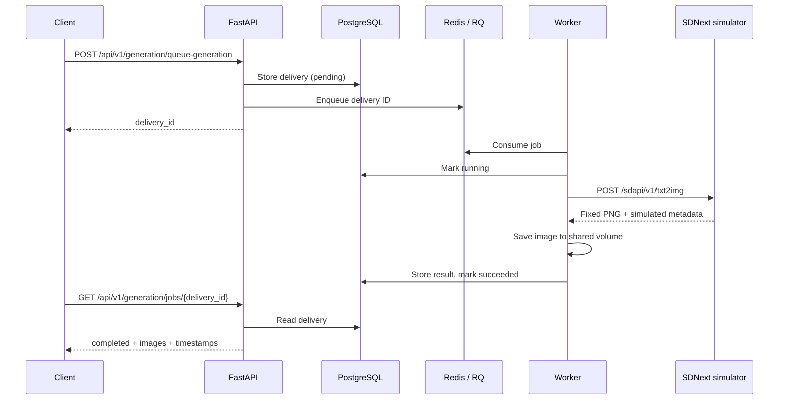

# Queued generation: backend demonstration

A reviewer can run one complete feature with `make demo` and verify it with
`make demo-check`. The SDNext HTTP service is a deterministic simulator; the
FastAPI application, PostgreSQL database, Redis queue, RQ worker and filesystem
storage are the application implementations. No model weights are downloaded.

## Follow a request



The HTTP status vocabulary is `queued → processing → completed` (or `failed`).
The repository stores `pending → running → succeeded`; presenters translate it.
Use the returned **delivery_id** to poll. The nested result's `job_id` identifies
SDNext output files and is a different ID.

```sh
curl -fsS http://127.0.0.1:18000/health
curl -fsS -X POST \
  'http://127.0.0.1:18000/api/v1/generation/queue-generation?save_images=true&return_format=base64' \
  -H 'Content-Type: application/json' -H 'X-API-Key: demo-token' \
  -d '{"prompt":"A blue square","seed":42,"steps":1,"width":64,"height":64}'
# Copy delivery_id from the response:
curl -fsS -H 'X-API-Key: demo-token' \
  http://127.0.0.1:18000/api/v1/generation/jobs/DELIVERY_ID
curl -fsS -H 'X-API-Key: demo-token' \
  http://127.0.0.1:18000/api/v1/generation/results
```

The simulator deliberately ignores requested dimensions and returns a fixed
32×32 PNG. Its `generation_info.simulated` is true. Swagger at `/api/docs` lets
you submit and inspect the same requests without curl.

## What the automated demonstration verifies

`make demo-check` starts the isolated stack, then:

1. Checks that Alembic finds no difference between migrations and model metadata.
2. Checks invalid input (422) and an unknown job (404).
3. Stops the worker, queues a job and proves it stays queued for two seconds.
   This detects an accidental switch to in-process background execution.
4. Starts the worker and polls for completion. Decodes the PNG, verifies its
   chunk checksums, checks timestamps and confirms identical bytes on shared disk.
5. Restarts the API and checks that the same result and history remain readable.
6. Injects HTTP 503, timeout, malformed JSON shape and invalid image data through
   the separate simulator. Each job fails with a safe message; upstream private
   details do not appear in the response. A final valid job proves worker recovery.

Checks intentionally add jobs to demo history and briefly stop its worker/API.
They always switch to the simulator, even if real SDNext overrides were exported.
Run `make demo-reset` then `make demo-check` to test an empty database. Run
`make demo-check` again to test an existing database. CI exercises both starts.

For diagnostics: `sh scripts/demo.sh logs`. `make demo-down` retains volumes;
`make demo-reset` removes only the fixed `lora-demo` project's containers and
volumes. Do not run multiple copies of this demo concurrently on the same Docker
host: they share that project name and loopback port 18000.

## Code to inspect

| Responsibility | Entry point |
| --- | --- |
| Outer application and mounted API lifecycle | [app/main.py](../app/main.py) |
| Validated HTTP queue request | [generation/jobs.py](../backend/api/v1/generation/jobs.py) |
| Queue selection and dispatch | [services/queue.py](../backend/services/queue.py) |
| Worker state transitions and persistence | [delivery_runner.py](../backend/workers/delivery_runner.py) |
| HTTP boundary, timeout and safe failures | [sdnext_client.py](../backend/delivery/sdnext_client.py) |
| Response validation and image persistence | [sdnext.py](../backend/delivery/sdnext.py), [storage.py](../backend/delivery/storage.py) |
| Real-service verification | [scripts/demo/smoke.py](../scripts/demo/smoke.py) |
| Separate simulator | [scripts/demo/simulator.py](../scripts/demo/simulator.py) |

Startup now enters the mounted backend's lifespan, so migrations and service
initialization happen before requests are served. PostgreSQL also needs a wider
Alembic version column because historical revision names exceed 32 characters;
the environment widens this bookkeeping column without renaming revisions.
Model timezone, text, nullability and foreign-key metadata match the existing
migrations. This does not upgrade SQLModel or add application tables.

## Decisions and tradeoffs

- **Separate worker:** keeps inference outside request handling and survives API
  restarts. It adds Redis and worker operations. The existing in-process fallback
  is convenient for local use but does not provide the same durability.
- **SQL history and Redis dispatch:** SQL is the readable job record, Redis carries
  execution. The two writes are not an atomic transaction; an outbox, idempotency
  keys and reconciliation would be needed for stronger delivery guarantees.
- **Shared filesystem:** easy to inspect locally. Database result writes and file
  writes are not atomic, and multi-image failures can leave partial files. Object
  storage, cleanup and retention policies are future work.
- **Base64 results:** convenient for one small example, costly for large images and
  histories. A production design should prefer bounded history and object URLs.
- **Deterministic simulator:** reproducible without a GPU and supports controlled
  failures. It does not prove compatibility with every SDNext release, cancellation,
  throughput or recovery after a worker dies during inference.
- **Safe errors:** clients get stable messages while server logs retain diagnostic
  details. Logs remain private operational data.
- **Local single-user security:** loopback binding keeps this demo local. The public
  demo key is not authentication; see the README security model.

## Optional real SDNext

Configure your own SDNext with its HTTP API enabled and a loaded model; see
[CUSTOM_SETUP.md](CUSTOM_SETUP.md). A host service must be reachable from Docker.
Use a model-appropriate inference timeout, for example:

```sh
DEMO_SDNEXT_BASE_URL=http://host.docker.internal:7860 \
DEMO_SDNEXT_TIMEOUT=300 make demo
```

The API and worker use the override; the simulator remains available for checks.
Submit a suitable prompt, resolution and step count through Swagger. GPU setup,
weights and real inference are optional and are not covered by the simulator
checks. Keep SDNext on a trusted network. For an authenticated SDNext installation,
use the normal development configuration's SDNext credential settings.
Run plain `make demo` without overrides to return to the simulator.
